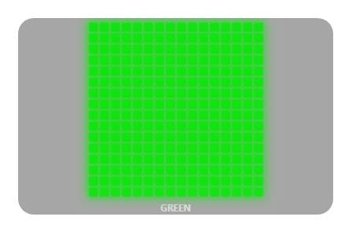
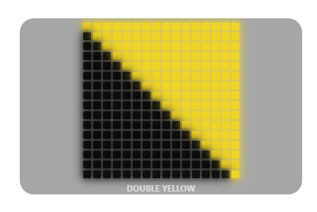
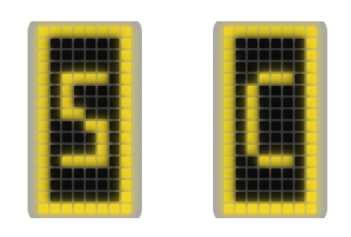
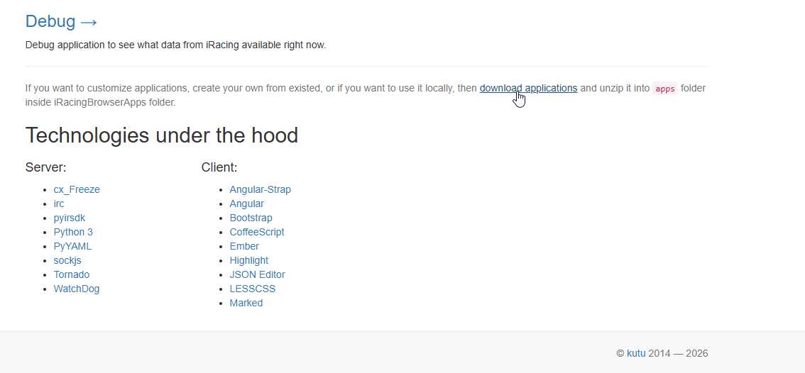
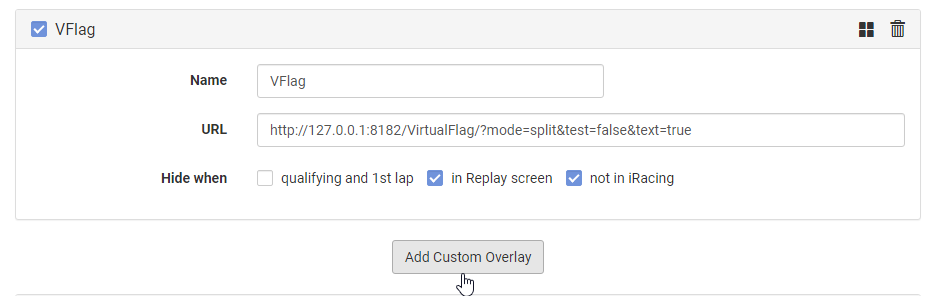

# Virtual Flag Overlay for Kapps (iRacing)

A professional LED matrix flag overlay for the Kapps iRacing overlay tool that displays race flags from your iRacing session. 
Features 14+ flag animations with intelligent queuing and split/compact display modes.





<!-- ## Quick Start -->

## Installation

### Preparing Kapps

The Kapps apps folder is located at:
```
C:\Users\[YourUsername]\AppData\Roaming\Kapps\
```

**"How do I get there?":**
1. Press `Win + R` to open the `Run Console`
2. Type: `%appdata%`
3. Press Enter
4. Navigate to the `Kapps\iRacingBrowserApps\` directory.

Paste the `apps` directory you downloaded [from here](https://ir-apps.kutu.ru/#!/) into the 
   ```
   C:\Users\[YourUsername]\AppData\Roaming\Kapps\iRacingBrowserApps\
   ```
directory.



5. **Download the VirtualFlag Widget** [The latest release](https://github.com/Asphelite/iRacing_Kapps_VirtualFlag_Overlay/releases/latest)
6. **Copy the VirtualFlag directory** to your Kapps apps directory:
   ```
   C:\Users\[YourUsername]\AppData\Roaming\Kapps\iRacingBrowserApps\
   ```

### Adding the Widget to Kapps

1. Open Kapps, then head to `Settings`.
2. In the `Settings` tab, the `Apps Folder` should now have this link pasted in (and clicking on the arrow should get you to the directory as well)


3. If thats all set, press `Save` and we can head to the next steps.

Next we add the widget to your overlay.

4. **Open Kapps** and go to the **Racing Overlay** tab
5. Click the `Add Custom Overlay` button to add a new overlay
6. Now we populate the fields:   -
   - Name: You can add a name of your choice.
   - URL: `http://127.0.0.1:8182/VirtualFlag/` - This has to be this link.



## Display Options (URL Parameters)

You can customize the overlay's widget background appearance using URL parameters as explained below.

### Display Mode

**`?mode=split`**
- Split screen with **two 8x16 LED matrices** side-by-side (30px gap)
- Each matrix has its own background opacity
- Better for wide displays
- *Default: Compact mode*

**`?mode=compact`**
- Single **16x16 LED matrix** (default)
- More compact, better for smaller screens
- Text message displayed below matrix

### Background Opacity

**`?opacity=0.0` to `?opacity=1.0`**
- Controls the background opacity (0 = transparent, 1 = fully opaque [not recommended])
- Default: `0.35` (slight transparency)
- Example: `?opacity=0.5` for 50% opacity

### Message Text

**`?text=false`**
- Hides the text message below the flag in compact mode
- Default: Text is shown
- Example: `?text=false&mode=compact`

### Widget Idle Fade

**`?idleFade=SECONDS`**
- Controls when the overlay fades after inactivity
- Value is in **seconds**
- `?idleFade=0` - Disable idle fade (no fading)
- `?idleFade=15` - Fade after 15 seconds (default)
- `?idleFade=30` - Fade after 30 seconds
- When faded, the overlay returns to full brightness when the next flag appears
- Example: `?idleFade=20` for 20-second timeout
- Default: 15 seconds

### Combined Examples

You can combine multiple parameters:

```
?mode=split&opacity=0.8&idleFade=20
?mode=compact&text=false&opacity=0.4&idleFade=0
?mode=split&opacity=0.6&idleFade=30
```

### Test Mode

Add **`?test=true`** to the overlay URL to cycle through all flag animations:
- Each flag displays for a few seconds
- Perfect for verifying the size of the LED matrixes on your screen.

To test a specific flag, add:
- `?test=true&flag=flagname`
  - Examples: `flag=yellow`, `flag=checkered`, `flag=safetycar`

### Available Test Flags

green, yellow, yellowWaving, blue, white, penalty, disqualify, meatball, slowdown, checkered, safetycar, debris, oneLapToGreen

## Troubleshooting

### Want to see detailed debug information?
- Add `?debug=true` to the overlay URL for console logging
- Default: Only shows startup message

### For anything more complex
- Text Asphelite on [Kapps Discord](https://kapps.kutu.ru/discord/)
- This is pretty self explanatory but I wont be able to help everyone installing this.


## How It Works

### iRacing SessionFlags

The app monitors real-time `SessionFlags` from iRacing and displays the current flag. It intelligently queues multiple simultaneous flags based on racing priority.

**Supported Flags:**
- **Green** - Session green
- **Yellow** - General caution
- **Yellow Waving** - Direction-specific waving yellow
- **Blue** - Faster traffic/lapping
- **White** - Final lap
- **Penalty** - Penalty/violation (slow down and improve)
- **Disqualify** - Disqualified
- **Meatball** - Mechanical issues (slow down and pit)
- **Slow Down** - Excessive speed or violation
- **One Lap To Go** - Final lap of race (animated)
- **Checkered** - Race finished
- **Safety Car** - Safety car deployed
- **Debris** - Debris on track
- **Red** - Session stopped

### Smart Flag Queuing

When multiple flags occur simultaneously, the overlay intelligently displays them based on racing logic:
- **Checkered** (race end) interrupts all other flags
- **Safety Car** interrupts most flags but runs with caution flags
- **Blue + Yellow** can display sequentially (faster car during caution)
- Flags automatically remove when they're no longer active in iRacing

### Animation Sequences

Each flag has its own unique animation:
- **Simple flags** (Green, Yellow, Blue, White) - Flashing
- **Complex animations** (OneLapToGo, Disqualify) - LED patterns
- **Caution flags** (Yellow, Debris, Safety Car) - Directional animations
- Animations queue automatically without overlapping

## Credits

Created for iRacing Kapps overlay framework.
All credit for the Kapps Overlay app go to [kutu](https://github.com/kutu).
[iRSDK Documentation](https://sajax.github.io/irsdkdocs/telemetry/sessionflags.html#sessionflags)

Overlay created by [Asphelite](https://github.com/Asphelite) ; &copy; 2026-01
I dont want to see forks or claiming credit for yourself. Else I will come and find you (in Minecraft). :P

For issues or feature requests, contact [Asphelite](https://github.com/Asphelite) on the [Kapps Discord](https://kapps.kutu.ru/discord/) or visit the [repository](https://github.com/Asphelite/iRacing_Kapps_VirtualFlag_Overlay) and [create an issue](https://github.com/Asphelite/iRacing_Kapps_VirtualFlag_Overlay/issues).
